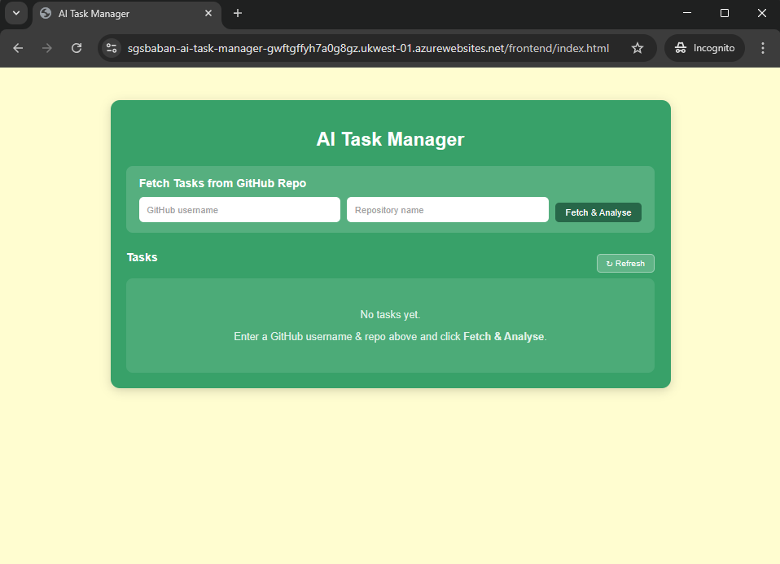
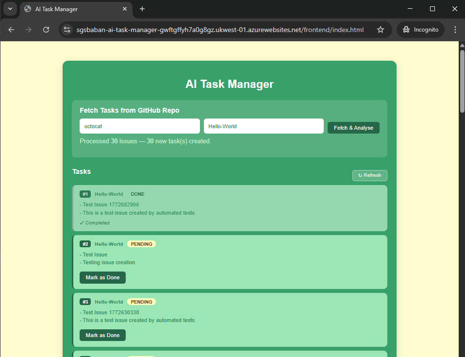
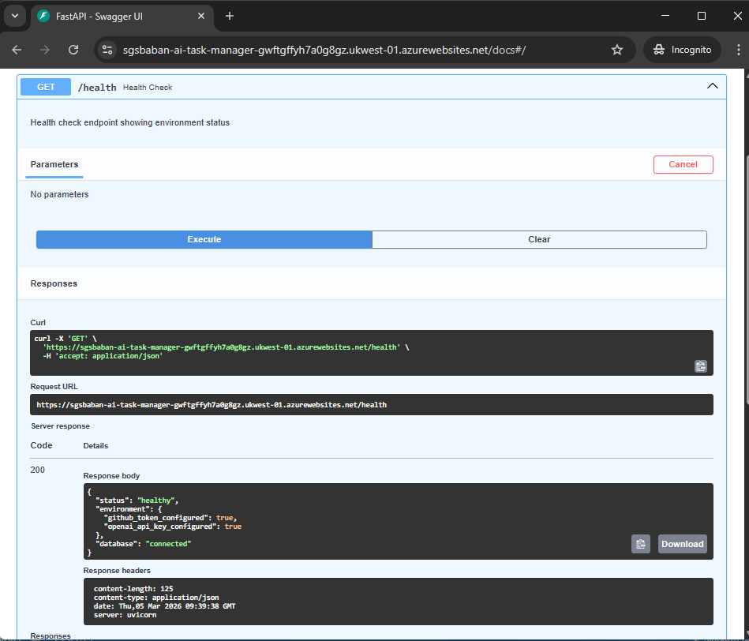

# AI Task Manager

AI Task Manager is an AI-powered agent that reads GitHub issues from any public repository, extracts actionable engineering tasks using AI, and stores them in a database. It includes a web frontend for viewing and managing tasks, and is deployed with Docker on Azure App Service.

Live demo: https://sgsbaban-ai-task-manager-gwftgffyh7a0g8gz.ukwest-01.azurewebsites.net/frontend/index.html

---

## Features

- Fetches issues from any public GitHub repository via the GitHub API
- Extracts actionable tasks using AI (OpenAI GPT-4o-mini, with a smart mock fallback)
- Stores tasks in a SQLite database with duplicate detection
- REST API built with FastAPI (GET, POST, PATCH endpoints)
- Web frontend for fetching, viewing, and completing tasks
- Health check endpoint showing environment and database status
- Dockerized with gunicorn + uvicorn for production
- Deployed on Azure App Service (Linux container)

---

## Tech Stack

| Layer | Technology |
|-------|-----------|
| Backend | Python 3.13, FastAPI, Gunicorn, Uvicorn |
| AI | OpenAI GPT-4o-mini (optional, works without it) |
| Database | SQLite (SQLAlchemy ORM) |
| Frontend | HTML, CSS, JavaScript |
| Containerization | Docker |
| Deployment | Azure App Service (Linux Container) |
| Registry | Docker Hub |

---

## Project Structure

```
ai-task-manager/
├── app/
│   ├── main.py          # FastAPI app, routes, lifespan
│   ├── database.py      # SQLAlchemy engine, session, init_db
│   ├── models.py        # Task model (SQLAlchemy)
│   ├── ai_logic.py      # AI summarization (OpenAI or mock)
│   └── github_api.py    # GitHub API client
├── frontend/
│   ├── index.html       # Main page
│   ├── app.js           # Frontend logic (fetch, render, mark done)
│   └── style.css        # Styles
├── Dockerfile           # Production Docker image
├── requirements.txt     # Python dependencies
├── .dockerignore        # Files excluded from Docker build
├── .gitignore           # Files excluded from Git
├── .env.example         # Example environment variables
├── ENVIRONMENT.md       # Environment variables and deployment guide
└── README.md            # This file
```

---

## API Endpoints

| Method | Endpoint | Description |
|--------|----------|-------------|
| GET | `/` | API status message |
| GET | `/health` | Environment and database health check |
| POST | `/process-task` | Fetch GitHub issues and create tasks |
| GET | `/tasks` | List all tasks (optional `?repo=` filter) |
| PATCH | `/tasks/{id}?new_status=done` | Update a task's status |
| GET | `/frontend/index.html` | Web frontend |

### Example: Create tasks from a repo

```bash
curl -X POST http://localhost:8000/process-task \
  -H "Content-Type: application/json" \
  -d '{"username": "octocat", "repo": "Hello-World"}'
```

Response:

```json
{
  "repo": "Hello-World",
  "issues_processed": 30,
  "new_tasks_created": 30,
  "message": "Processed 30 issues, created 30 new tasks"
}
```

---

## Setup

### Prerequisites

- Docker installed ([Get Docker](https://docs.docker.com/get-docker/))

### Quick Start

```bash
git clone https://github.com/<your-username>/ai-task-manager.git
cd ai-task-manager
docker build -t ai-task-manager .
docker run -p 8000:8000 ai-task-manager
```

Open http://localhost:8000/frontend/index.html in your browser.

### With Environment Variables (optional)

```bash
docker run -p 8000:8000 \
  -e GITHUB_TOKEN=ghp_your_token_here \
  -e OPENAI_API_KEY=sk-your_key_here \
  ai-task-manager
```

| Variable | Required | Purpose |
|----------|----------|---------|
| `GITHUB_TOKEN` | No | Raises GitHub API rate limit from 60 to 5000 requests/hour |
| `OPENAI_API_KEY` | No | Enables real AI task extraction (works without it using mock logic) |

### Run Without Docker

```bash
python -m venv venv
venv\Scripts\activate        # Windows
pip install -r requirements.txt
uvicorn app.main:app --reload
```

---

## Screenshots

### Frontend -- Task List



### Fetching Tasks from GitHub



### API Health Check



> To add screenshots: take screenshots of the app and save them in the `screenshots/` folder with the filenames above.

---

## Deployment

The app is deployed on Azure App Service as a Linux Docker container.

Docker Hub image: `sgsbaban/ai-task-manager:latest`

### Deploy to Azure

1. Push image to Docker Hub:

```bash
docker tag ai-task-manager sgsbaban/ai-task-manager:latest
docker push sgsbaban/ai-task-manager:latest
```

2. In Azure Portal, create a Web App:
   - Publish: Docker Container
   - OS: Linux
   - Image: `sgsbaban/ai-task-manager:latest`
   - Port: `8000`

3. Set environment variables in Azure App Service Configuration:
   - `WEBSITES_PORT` = `8000`
   - `GITHUB_TOKEN` = your token (optional)
   - `OPENAI_API_KEY` = your key (optional)

---

## License

MIT
